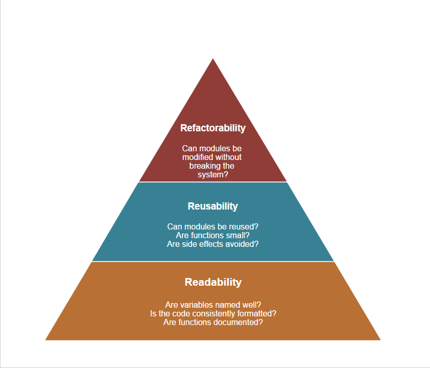
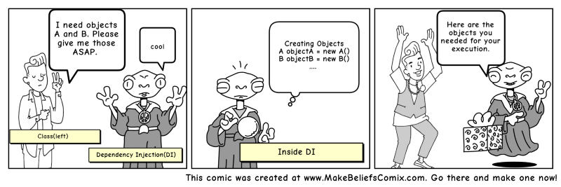

# SAP-Hybris-Commerce-Clean-Code


## Table of Contents
  1. [Introduction](#introduction)
  2. [General Recommendations](#general-recommendations)
  3. [Development Principles](#development-principles)
  4. [Itelligence Naming Conventions](#itelligence-naming-conventions)
  5. [Code Hygiene](#code-hygiene)
  6. [Javadoc](#javadoc)
  7. [Items-items.xml](#items-itemsxml)
  8. [Jalos](#jalos)
  9. [Libs](#libs)
  10. [Properties](#properties)
  11. [Spring](#spring)
  12. [Tests](#tests)

## Introduction


Software engineering principles, from Robert C. Martin's book
[*Clean Code*](https://www.amazon.com/Clean-Code-Handbook-Software-Craftsmanship/dp/0132350882),
adapted for SAP Hybris Commerce ( JAVA ) . This is not a style guide. It's a guide to producing
readable, reusable, and refactorable software in SAP Hybris Commerce platform.

## Excerpt from the book :  

Which door represents your code? Which door represents your team or your company?
Why are we in that room? Is this just a normal code review or have we found a stream of
horrible problems shortly after going live? Are we debugging in a panic, poring over code
that we thought worked? Are customers leaving in droves and managers breathing down 
our necks? How can we make sure we wind up behind the right door when the going gets
tough? The answer is: craftsmanship.
There are two parts to learning craftsmanship: knowledge and work. You must gain
the knowledge of principles, patterns, practices, and heuristics that a craftsman knows, and
you must also grind that knowledge into your fingers, eyes, and gut by working hard and
practicing.

## Software Architecture

After 50+ years of software engineering's existence, we haven't settled on an exact definition of what software architecture is. After all, it is the art in computer science -- persistently evading our most determined of efforts to define it. Even still, it's so vital to the fabric of our industry and applications, that it's impossible to ignore.

Despite our lack of agreement, there are a lot of definitions that can help bring us closer to a formalization of software architecture. Perhaps the most notable of such comes from the IEEE:

>"Architecture is the fundamental organization of a system embodied in its components, their relationships to each other, and to the environment, and the principles guiding its design and evolution." [IEEE 1471]

While this definition and others can bring clarity to the elements that make up architecture, it doesn't give us a mental model to use when developing our applications. This project however, aims to give just that. By looking at 3 particular "ilities" (readability, reusability, and refactorability), we can form a hierarchy of architectural attributes that can give us a framework for thinking about our system's code and architecture. It won't give you an architecture per se, but it will guide you in thinking about what architecture works for your application.

## **General Recommendations**

* Most of these recommendations should be covered by SonarQube. However, if every developer already have them in mind while developing and not have to refactor the code afterwards, the whole development process should be more efficient.
* Avoid hard-coding of numbers and strings. These should be refactored out into constants of the class/interface or into configured values if needed.

**Bad:**

```java
return "redirect:/";
```

**Good:**
```java
public static final String REDIRECT_PREFIX = "redirect:/" ;

return REDIRECT_PREFIX;
```
* Classes should be loosely coupled. Use the dependency injection concept instead of hard coding into other POJOs. Therefore avoid use of the “new” java keyword. Loosely coupled code is easier to test.



**Bad:**

```java
public class DefaultTeknosaCartService implements TeknosaCartService {
        
    public List<CartModel> findUnApprovedItemsInCart(final Date cartAge) {
        return new DefaultTeknosaCartDao().findUnApprovedItemsInCart(cartAge);
    }

    @Override
    public CartModel getCartForCode(String code) {
        return new DefaultTeknosaCartDao().getCartForCode(code);

    }
}
```

* the benefit of having the interface in the first place has been negated since the concrete instance was created locally, and
TeknosaCartDao cannot easily be replaced by a mock object for testing purposes.

**Good:**
```xml
    <alias name="defaultTeknosaCartDao" alias="teknosaCartDao"/>
    <bean id="defaultTeknosaCartDao" class="tr.com.itelligence.teknosa.core.daos.impl.DefaultTeknosaCartDao"/>
```

```java
public class DefaultTeknosaCartService implements TeknosaCartService {
        
    @Resource(name = "teknosaCartDao")
    private TeknosaCartDao teknosaCartDao;

    public List<CartModel> findUnApprovedItemsInCart(final Date cartAge) {
        return teknosaCartDao.findUnApprovedItemsInCart(cartAge);
    }

    @Override
    public CartModel getCartForCode(String code) {
        return teknosaCartDao.getCartForCode(code);

    }
}
```

* Constantly refactor code. Refactoring helps to code “loosely coupled simple POJOs”. Keep POJOs small and methods short. Each POJO should have one main area of concern. If a POJO is growing very large, refactor its functionality into two POJOs.

* Classes implement interfaces, unless it is a DTO or some simple helper class or something similar.
* Do not expose internal information (e.g. avoid a public getter to an internal dependency), always think twice, if there is a public/protected method.

* Favor composition over inheritance. Sometimes inheritance results in a rigid design. Composition makes classes loosely coupled, which are easier to reuse and easier to test.
* Methods should not be long and contain only few nested if/for stuff. A method should usually fit within one readable page, which would be approximately 25-30 lines (including blank lines and comments). If a method is longer than that, make an effort to decompose it into smaller units. This is not a rule but a best practice and some of these best practices are also governed by the complexity of the algorithms that make a method. A method should usually carry out a unit of work and the name should reflect that.
* When protected methods are used they should be stated explicitly as designed for extending. If this is not the case the writer was not thinking about extendibility and the method should be private.More information about private / protected / public classes [java-access-modifiers](https://beginnersbook.com/2013/05/java-access-modifiers/)

* All logic using flexible search should be covered in separate classes (DAO) to allow independent testing from logic.
* Don’t use "* " forms of import. Be precise about what you are importing. Check that all declared imports, that are actually used.
* Ensure that there is ultimately a catch for all unchecked exceptions that can be dealt with.
* Catch only exceptions you can handle.
* Don’t swallow exceptions silently.
* A good design requires minimum coupling between the classes. The general rule is to be as restrictive as possible when setting the visibility of a method. If method doesn’t have to be public then make it protected, and if it doesn’t have to be protected then make it private.
* Try to initialize local variables where they're declared. The only reason not to initialize a variable where it's declared is if the initial value depends on some computation occurring 
* Always use the minimum possible scope for variables.
* Make variables final if possible, consider refactoring your code if you can't make them final.
* Never reassign method parameters.
* Don’t change generated code (unless you really know why you are doing that).
* Static methods should be avoided, as it is more spring style to use singleton scoped beans (see properties section for a reason why)

**[⬆ back to top](#table-of-contents)**


## Development Principles

* These general principles should be followed on every development.
* Don't use automatic boxing and unboxing. Return early and return often.
[Automatic boxing and unboxing](https://docs.oracle.com/javase/tutorial/java/data/autoboxing.html#:~:text=all%20JDK%20releases.-,Autoboxing%20and%20Unboxing,way%2C%20this%20is%20called%20unboxing.)

````java
    public Map<WarehouseModel, List<Long>> findAvailabilityAccordingToKITMatrix
            (Collection<StockLevelModel> stockLevels, final ProductModel kitProduct) {

        Set<ProductReferenceModel> refs = this.getKITReferenceProducts(kitProduct);
        // return immediately
        if (CollectionUtils.isEmpty(stockLevels)) {
            return null;
        }
}
````
* Write small classes and short methods. Split spring XML files logically.
* Reduce cyclomatic complexity.

**[⬆ back to top](#table-of-contents)**

## Itelligence Naming Conventions
* Naming conventions should always be followed to make the code better readable and updatable with new out of the box code, that might ship with future hybris releases.
###Classes

* Alway use the project shortcut as prefix (e.g. 'ZfdeCustomerAccountService'). Always use the suffix 'UnitTest' for unit tests.
* Always use the suffix 'IntegrationTest' for integration tests.

#### Itelligence CX Naming convention Formula :

 ```` java 
// if there is a interface

formula = "Default" + {PROJECT_NAME} + {USED_OBJET_NAME} + {WHAT_IS_IT_FOR}

// Example
"DefaultTeknosaCartService"
"DefaultCarrefoursaOrderSubmitEventListener"
"DefaultSaxionCommerceCartCalculationStrategy"

formula =  {PROJECT_NAME} + {USED_OBJET_NAME} + {WHAT_IS_IT_FOR}

// Example
"TeknosaCartService"
"CarrefoursaOrderSubmitEventListener"
"SaxionCommerceCartCalculationStrategy"

// default formula =  {PROJECT_NAME} + {USED_OBJET_NAME} + {WHAT_IS_IT_FOR}

// Example
"KoctasBasicProductPopulator"

````

### Methods :

* Methods should be verbs, in mixed case with the first letter lowercase and with the first letter of each internal word capitalised.
* Give meaningful names to methods. Don't use very short names.
Examples:
```` java
public List<CartModel> getCartsByCustomerAndPaymentType(PaymentType paymentType, UserModel userModel);
protected CommerceCartModification doAddToCart(final CommerceCartParameter parameter);
public boolean recalculateCart(final CommerceCartParameter parameter);
````

### Variables : 
* Variable names should be short yet meaningful.
* Should not start with underscore(‘_’) or dollar sign ‘$’ characters.
Should be mnemonic i.e, designed to indicate to the casual observer the intent of its use.
One-character variable names should be avoided except for temporary variables.
Common names for temporary variables are i, j, k, m, and n for integers; c, d, and e for characters.

````java
//Examples:
    int productReviewCount = 0;
    int customerReviewCount = 1;
````

### Constant variables:
Should be all uppercase with words separated by underscores (“_”).
There are various constants used in predefined classes like Float, Long, String etc.

````java
// Examples:

static final int MIN_WIDTH = 4;

// Some  Constant variables used in predefined Float class
public static final float POSITIVE_INFINITY = 1.0f / 0.0f;
public static final float NEGATIVE_INFINITY = -1.0f / 0.0f;
public static final float NaN = 0.0f / 0.0f;

````

### Packages:
The prefix of a unique package name is always written in all-lowercase ASCII letters and should be one of the top-level domain names, like com, edu, gov, mil, net, org.
Subsequent components of the package name vary according to an organisation’s own internal naming conventions.
````java
//Examples:

package tr.com.itelligence.teknosa;
package tr.com.itelligence.carrefoursa;

// java.lang packet in JDK
java.lang
````

### Spring Beans

* Alway use the project shortcut as prefix (e.g. 'Zfde' for beans in the XYZ project). Give meaningful names to spring beans.
* Bean name and alias should not be the same.

### Data Access Objects (DAOs)

* Use the 'find' prefix for search operations (e.g. 'findProductsForCode', 'findCustomerForUid'). Use the 'create' prefix for create operations.
* Use the 'delete' prefix for delete operations.

**[⬆ back to top](#table-of-contents)**

## Code hygiene

* A developer should have these general remarks in mind, before committing something.
* Avoid commented-out code. It makes the code hard to read. Classes should not contain any java or pmd warnings.
* All APIs should have full value-add JavaDoc.
* Unnecessary comments should be removed.
* Avoid useless comments in self-explaining code.
* Automatically generated JavaDoc should be avoided.
* Value-add commenting should only be used for a better understanding of tricky code.
* If it is too tricky, it is probably best to split it up make it less tricky but more understandable.

**[⬆ back to top](#table-of-contents)**

## Javadoc

* The following rules should be followed regarding documenting code.
* Each class as well as each public method needs javadoc.
* Avoid automatically-generated commenting.
* Each protected method needs javadoc explaining how extendibility is designed. Synchronization needs to be documented.
* Don’t document property style getters and setter (e.g. on a DTO).

**[⬆ back to top](#table-of-contents)**

## Items items.xml

-Follow naming convention (camelcase, singular/plural of attributes/types). Write description tags for describing an attribute.
* Consider attribute type sizes.
* Write unique flags for attributes.
* Do not add indexes, as index managing is cost intensive, indexes will be added for that item as and when it is required. Attributes which needs to be displayed in different languages must be localized.
* Avoid using collections in favor of relations.
* Check, that each type/attribute provides a basic hmc configuration.
* Define types in order of inheritance. More abstract types need to be defined more to the beginning of the items.xml file and more concrete types need to be defined more to the end.
* Use type codes in the deployment tag between 15000 and 20000.
* A deployment table must be defined for all items extending GenericItem.
* A deployment table must not be defined for any Items extending any item other than GenericItem.
* A deployment table must be defined for all many-to-many relations.
* Mandatory fields (where optional='false') must either have initial set to 'true' or a default value defined. Immutable fields (where write='false') must have initial set to 'true'.
* Attributes should not have a persistence type of 'jalo', use 'dynamic' instead.
* Type Names (including EnumTypes and Relations) must start with an uppercase letter.
* Type Names must not start with the string Generated.
* Item attribute names must start with a lowercase letter.
* Relationship qualifier names must start with a lowercase letter.
* Any side of a relation that has cardinality='many' should not have ordered='true' unless absolutely necessary, otherwise this will might impact catalog synchronization in a very negative way.
* Any side of a relation that has cardinality='many' should have collectiontype='set'.
* Any additions to items.xml must be peer reviewed and tested carefully as item.xml is critical part of the application.
* Before adding any itemtype to item.xml, make sure that there doesn't exist an item of the same type in any of the extensions. If it exists, it must be used/extended to avoid multiple instances of the same type.
* Hardly change an attribute definition. A change of upper/lower case spelling will cause API incompatibilities, because the signature of generated getters/setters will change. With that the data will be stored in a new column and the old data is not accessible anymore by the generated API.
* Never change the deployment code/name.

## Jalos

* Check each jalo class and assure that they are empty. Assure that all jalo classes are in the jalo package.

**[⬆ back to top](#table-of-contents)**

## Libs

* Assure that the version number is at the end of the lib name.
* Assure it is in the correct folder (either lib or web/webroot/WEB-INF/lib depending on usage scope - typical web libs like display tag should be at web lib).
* Assure that it is listed in .classpath file (for platform also integration folder .classpath).
* Assure that source .zips follow naming convention and are placed in the doc folder.
* Do not duplicate libs from other extensions.
* Carefully consider any manual changes to 3rd party jars.
* Use trusted download sources for jars.

**[⬆ back to top](#table-of-contents)**

## Properties

* Do not rename/remove properties. Ensure compatibility with earlier releases. Document each property.
* Consider, that properties can’t be accessed in a static context.

**[⬆ back to top](#table-of-contents)**

## Spring

* Check the scope of each bean - must be "singleton", unless there is a reason not to do so (e.g. some of the beans in cockpits have session scope).
* Default services should have aliases.
* Custom services should be aliased, that way you could customize standard functionality and access the default service by using the default bean name.
* Use property files for storing values that may be changed by administrators.
* Assure that classes defined as beans are placed in the correct folder.
* Use a rich set of annotations available. Annotations makes code easy to read and reduce the dependency on spring.

**[⬆ back to top](#table-of-contents)**

## Tests

* Write test cases which
* are simple unit tests that do not extend HybrisJunit4Test.
* use autowring for injection.
* use mocking and easymock (or other mocking framework).
* use commenting to clarify the purpose of a test.
* demonstrate when which exceptions are thrown.
* are aimed to help a new developer in understanding the expected behavior.
* Each class should have a related test class (including web classes).
* Only classes having flexible searches should extend HybrisJunit4Test and its derivates. Those are probably integrative tests. Consider TDD (Test Driven Development).
* Assure that each class gets a test class in the same package.

**[⬆ back to top](#table-of-contents)**
